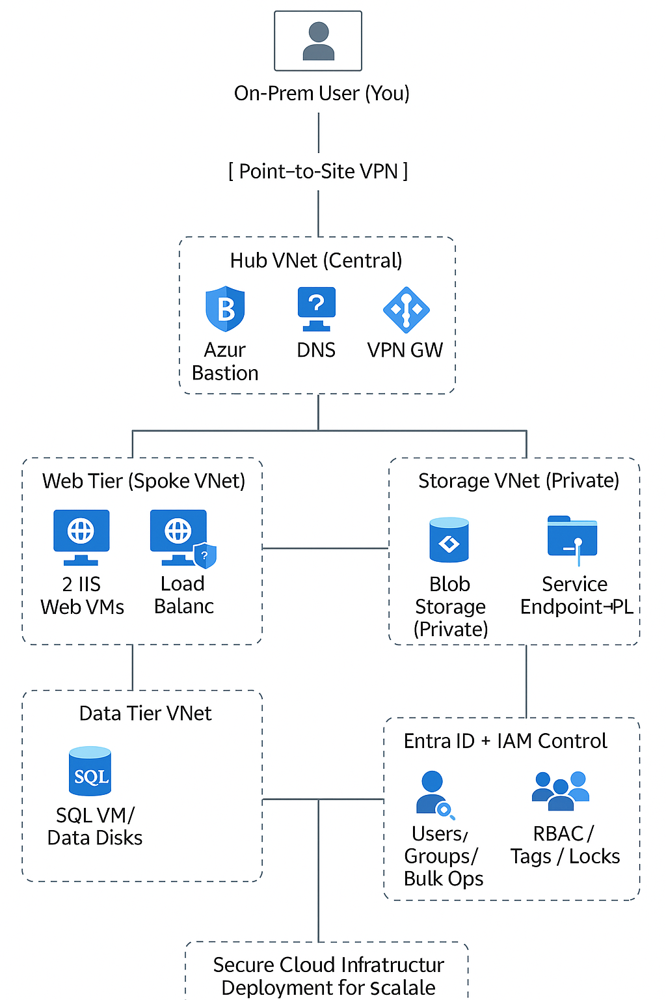

# Secure-and-Scalable-Enterprise-Infrastructure-Deployment-on-Microsoft-Azure
Designed and deployed a secure, scalable enterprise infrastructure on Microsoft Azure with hub-and-spoke networking, VM-based web tier, private storage, Entra ID access control, VPN/Bastion access, and Azure Monitor alerts

This project demonstrates the creation of a secure, enterprise-grade cloud environment on Azure, covering networking, identity, storage, security, and monitoring. It simulates a production-grade environment for a scalable web application hosted in Azure.

## 🧱 Components

- VNet Peering, Custom Routes, Subnet Isolation
- Azure Bastion, VPN, NSG/ASG
- Blob lifecycle rules, file share snapshots, SAS
- Microsoft Entra ID for user/group/RBAC
- Load Balancer, Private DNS, Private Link
- Azure Monitor for real-time alerting

## 📐 Architecture

## 🚀 Deployment Overview

1. Hub-and-Spoke VNet setup
2. VM provisioning
3. Storage + Secure Access
4. Entra ID user/group management
5. Monitoring and alerting

## 📁 Project Structure

